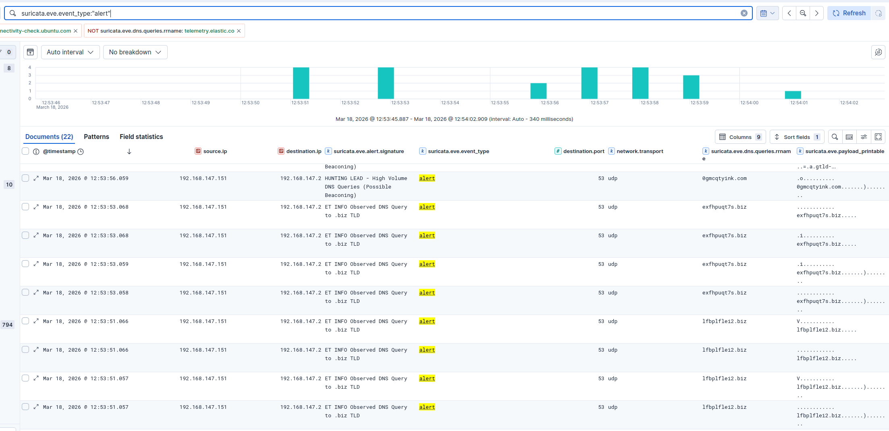
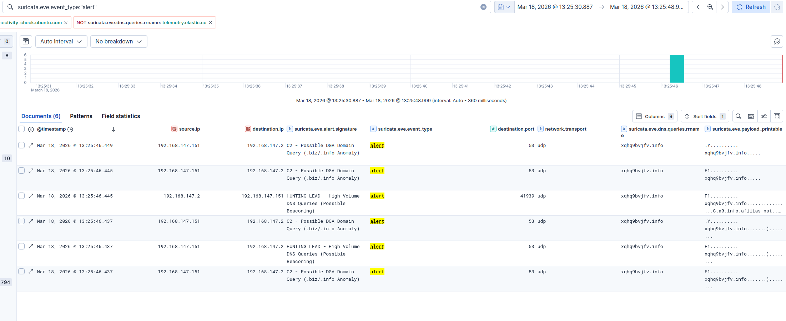

# TA0011 Command & Control

This tactic is used by the adversary to contact its own server from a compromised system either to execute commands remotely or download payloads. To evade detection the malware programatically generates numerous random domains, seeking the one active domain.

## T1568.002 Domain Generation Algorithm

### 1. Scenario

This technique is used by adversary to dynamically identify a C2 server. Generates a high volume of DNS queries for structurally anomalous, pseudo-random alphanumeric strings.

### 2. Problem



Relying on standard community signatures (Emerging Threats in this case) for DGA detectionoften result in shallow, easilty bypassed alerts, intial observation showed generic rules firing purely on the presence of a specific Top-Level Domain. Writing a broad PCRE (Regex) rule to alert on 1+ character alphanumeric string creates severe false-positive risks on legitimate enterprise domains.

### 3. Solution

Engineered a custom rule that targets a 10+ character alphanumeric string particularly with TLDs of `.biz` and `.info` as they are not used so often in legitimate domains.

### 4. Custom Ruleset

```xml
# THE STRUCTURAL ANOMALY
alert dns $HOME_NET any -> any any (msg:"C2 - Possible DGA Domain Query (.biz/.info Anomaly)"; dns.query; pcre:"/[a-zA-Z0-9]{10,}\.(biz|info)/i"; classtype:trojan-activity; priority:2; sid:1000100; rev:1;)
```

### 5. Result



The Suricata engine successfully detected the DGA simulation. Kibana visualization demonstrated critical alert correlation, it successfully identified the random xqhq9bvjfv.info payload, while the previously established HUNTING LEAD rule flagged the programmatic volume of the requests. This validated a layered detection pipeline capable of identifying both the shape and behavior of advanced C2 mechanisms.
