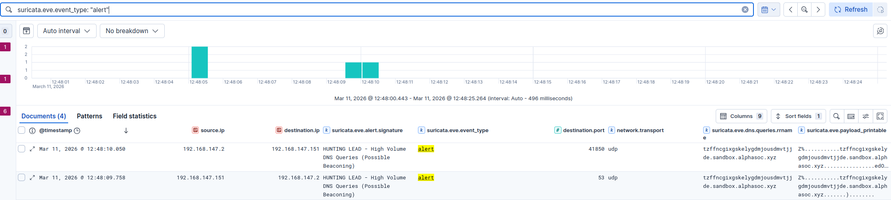
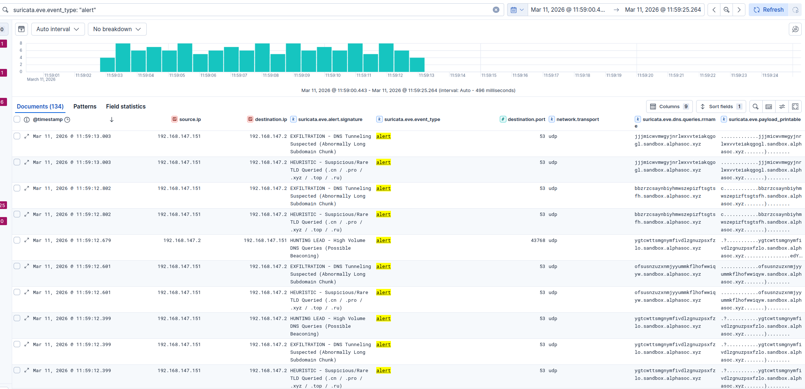

# TA0010 Exfiltration

Tactic used by adversaries to steal/exfiltrate data via allowed protocols as direct outbound connections connections are blocked by firewalls.

## T1048.003 Exfiltration over Unencrypted protocol

Adversaries may exfiltrate data by encapsulating it within standard, unencrypted network protocols, most commonly DNS. The stolen data is encoded and placed into the subdomain field of a DNS query destined for an attacker-controlled Name Server (NS).

### 1. Scenario

Simulating data exfiltration via DNS Tunneling using AlphaSOC Flightsim to evaluate the pipeline's ability to identify protocol abuse and data smuggling, independently of volume or domain reputation.

### 2. Problem



Initial testing revealed an issue with Incidental Detection. The previously established behavioral rules (volume thresholds and suspicious TLD heuristics) successfully triggered during the exfiltration simulation. However, they detected the side-effects of the attack (the burst speed and the .xyz domain) rather than deterministically identifying the data theft. If an advanced adversary throttled their exfiltration speed to bypass the threshold and routed the tunnel through a trusted .com domain, the existing pipeline would be completely blind to the payload.

### 3. Solution

Engineered a protocol anomaly detection rule utilizing PCRE (Regex). Rather than evaluating the destination domain's reputation, the rule analyzes the structural shape of the payload itself. It identifies continuous alphanumeric strings exceeding standard subdomain lengths (20+ characters) positioned anywhere within the DNS query, effectively catching the smuggled chunks of data regardless of the parent domain or transfer speed.

### 4. Custom Ruleset

```text
# 5. DNS tunneling - EXFILTRATION (Priority 2 - High)
#alert dns $HOME_NET any -> any any (msg:"EXFILTRATION - DNS Tunneling Suspected (Abnormally Long Subdomain Chunk)"; dns.query; pcre:"/[a-zA-Z0-9\-_]{20,}\./"; classtype:network-scan; priority:2; sid:1000070; rev:1;)
```

### 5. Result



The Suricata engine successfully detected the encapsulated data payloads. Kibana visualization demonstrated that while existing heuristic rules incidentally caught the suspicious .xyz domain, the new deterministic EXFILTRATION rule successfully isolated and flagged the specific 20+ character malicious payloads. This validated the efficacy of stacking protocol anomaly detection alongside standard indicators to ensure high-confidence true positives during data smuggling attempts.
